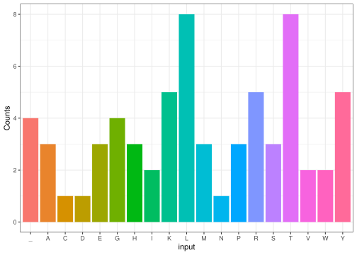

# About the package

The following package contains function which can be used to the extract
the transcripted mRNA sequence from a DNA sequence. The package also
contains amino acid codon data[^1], therefore the translated amino acid
sequence can be obtained from the mRNA sequence. For testing or
demonstration purposes, a random DNA sequence can also be generated
using functions.

The package depends on `ggplot2` and `stringr` packages for plotting the
amino acid counts. While development, our group has tried to reduce the
number of dependencies, so that the package works out-of-the-box, and
also does not have any conflict with the namespace. Regardless, for
integration the plotting function, the above-mentioned packages have to
be loaded.

``` r
library("cdogmag22")
```

## Functions:

``` r
set.seed(22160)
dna <- generate_dna_sequence(200)
print(dna)
#> [1] "ATGAGCATGGAGTAATACTGGTGCTACCCAAGAACAACGGGCATATTAGCTAAGGGTCGTTACGGGTATACGTACCTAACCGATAGTCATTAACGTCACCCAGGTACTAACCTGCTCGTAAAAATGGCATAAACGAAACTATGGGAGGTGAAAAAGCATCGACGACTACCTTTAATCTTGGCTACCGAATGAACCTCGCT"
```

``` r
rna <- DNA_to_RNA(dna)
print(rna)
#> [1] "AUGAGCAUGGAGUAAUACUGGUGCUACCCAAGAACAACGGGCAUAUUAGCUAAGGGUCGUUACGGGUAUACGUACCUAACCGAUAGUCAUUAACGUCACCCAGGUACUAACCUGCUCGUAAAAAUGGCAUAAACGAAACUAUGGGAGGUGAAAAAGCAUCGACGACUACCUUUAAUCUUGGCUACCGAAUGAACCUCGCU"
```

``` r
codons <- codon(rna,
                start = 1)
print(codons)
#>  [1] "AUG" "AGC" "AUG" "GAG" "UAA" "UAC" "UGG" "UGC" "UAC" "CCA" "AGA" "ACA"
#> [13] "ACG" "GGC" "AUA" "UUA" "GCU" "AAG" "GGU" "CGU" "UAC" "GGG" "UAU" "ACG"
#> [25] "UAC" "CUA" "ACC" "GAU" "AGU" "CAU" "UAA" "CGU" "CAC" "CCA" "GGU" "ACU"
#> [37] "AAC" "CUG" "CUC" "GUA" "AAA" "AUG" "GCA" "UAA" "ACG" "AAA" "CUA" "UGG"
#> [49] "GAG" "GUG" "AAA" "AAG" "CAU" "CGA" "CGA" "CUA" "CCU" "UUA" "AUC" "UUG"
#> [61] "GCU" "ACC" "GAA" "UGA" "ACC" "UCG"
```

``` r
amino <- codon_to_amino_acids(codons)
print(amino)
#> [1] "MSME_YWCYPRTTGILAKGRYGYTYLTDSH_RHPGTNLLVKMA_TKLWEVKKHRRLPLILATE_TS"
```

``` r
plot_char_counts(amino)
```

<!-- -->

## Pipe workflow:

``` r
set.seed(22160)
aminoplot <- generate_dna_sequence(200) |>
  DNA_to_RNA() |>
    codon(start = 1) |>
      codon_to_amino_acids() |>
        plot_char_counts()
print(aminoplot)
```

<!-- -->

## Use cases

The package has good use cases for bioinformaticians translating DNA
data into amino acid sequences or just having an easy function for
obtaining transcripted mRNA. The package can also help investigating
bias or differences in both the DNA and amino acid sequences.

A useful addition would be to add the reverse translation, meaning
implementing functions that take the amino acid sequence as an input and
produce the corresponding DNA sequence.

[^1]: <https://www.ncbi.nlm.nih.gov/Taxonomy/Utils/wprintgc.cgi?chapter=tgencodes#SG1>
